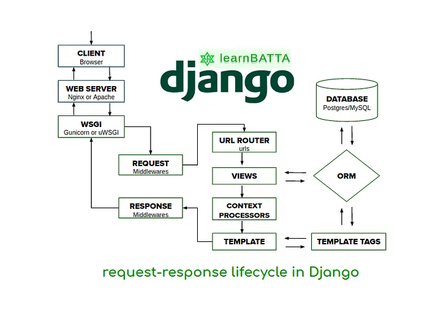
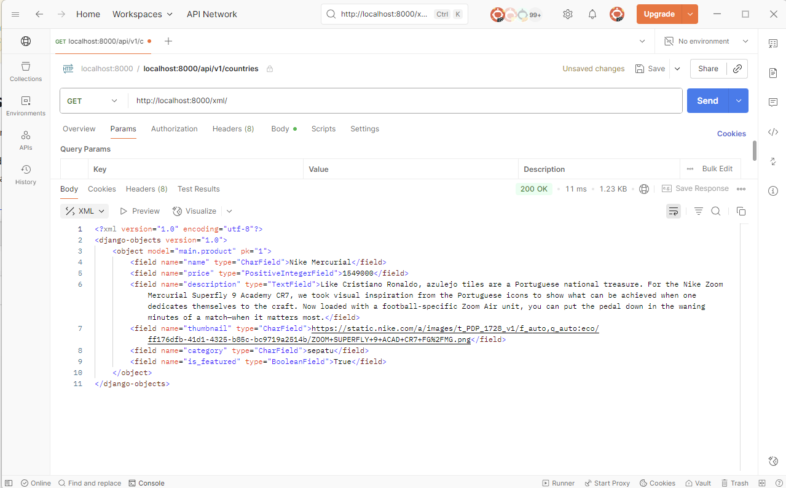
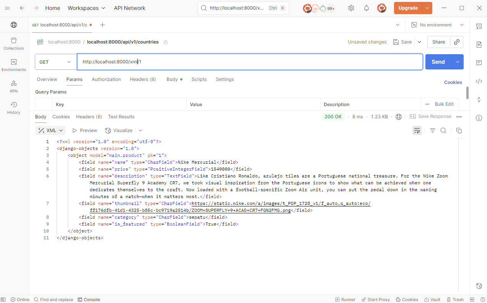
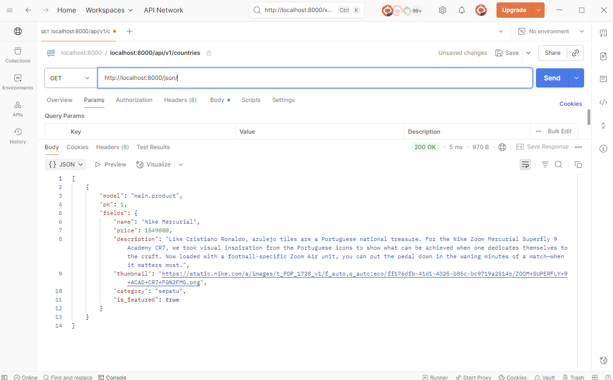
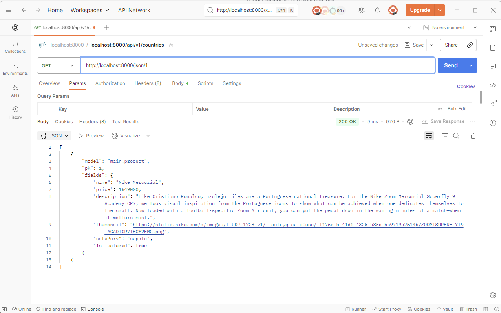

"# mustard-sports"

Cara saya membuat tugas ini dan mengimplementasikan checklist yang ada di web pbp adalah dengan pertama saya membuat proyek django yang sebelumnya sudah dipelajari saat sesi lab. Pembuatan ini diawali dengan membuat direktori baru bernama mustard-sports, lalu saya mengaktifkan virutal enivornment dan membuat proyek django menggunakan requirements.txt, isi dari file txt tersebut adalah hal-hal yang diperlukan untuk menginstall django. Instalasinya juga tidak rumit dan hanya memerlukan 1 perintah di command prompt, waktunya juga tidak begitu lama. Setelah django terinstall, saya membuat file .env yang meurpakan environment variables yang disimpan di luar kode program. Environment variables adalah variabel yang disimpan di luar kode program dan digunakan untuk menyimpan informasi konfigurasi seperti kredensial database, API keys, atau pengaturan environment. Ini memungkinkan kode yang sama berjalan di environment berbeda tanpa perlu mengubah kode. Lalu saya juga membuat file .env.prod yang digunakan untuk production deployment. Karena PRODUCTION=True, aplikasi akan menggunakan database PostgreSQL dengan kredensial yang disediakan ITF Fasilkom UI. Lalu saya juga mengubah settings.py agar dapat menggunakan environment variables. Kemudian saya juga mengubah isi dari ALLOWED_HOSTS agar bisa mengakses aplikasi web lewat local host. Tak lupa juga saya menambahkan konfigurasi PRODUCTION dan mengubah konfigurasi database di settings.py. 

Setelah itu saya menyambungkan direktori mustard-sports dengan github dengan membuat repositori baru di github, lalu saya melakukan git init untuk membuat folder .git, lalu saya juga membuat file/berkas .gitignore untuk menentukan berkas-berkas yang diabaikan oleh git. Lalu saya melakukan git remote add origin (link repositori) agar git tahu harus mengirim kode saya ke repositori spesifik itu saat melakukan push. Lalu saya membuast branch utama bernama master dan melalukan add, commit, push.

Setelah itu, saya melakukan deploy lewat PWS. Pertama saya membuat proyek baru di PWS dan mengubah environs dengan isi dari berkas   .env.prod lalu saya menambahkan URL dari deployment PWS ke ALLOWED_HOSTS agar saya bisa view project. Lalu saya melakukan push ke pws agar kode di pws merupakan yang paling baru.

Setelah itu, saya membuat aplikasi baru yang bernama main pada proyek saya yang bernama mustard sports. Lalu agar main dapat dijalankan di proyek, saya menambahkan main ke INSTALLED_APPS. Karena tema utama dari proyek ini adalah toko bola, maka saya mengubah model-model yang ada di models.py. Model-model yang saya guanakn adalah jersey, sepatu, celana, joggers, kaus kaki, bola, dan lainnya. Lalu saya menambahkan nama untuk nama item, price untuk harga item, description untuk deskripsi item, category untuk kategori item, thumbnail untuk gambar item, dan is_featured untuk menunjukkan barang yang 'featured' atau sedang direkomendasikan.
Alasan saya menggunakan tipe data yang digunakan adalah karena
nama, category : CharField karena tipe data yang cocok untuk menyimpan teks singkat
price : IntegerField karena tipe data yang cocok untuk menyimpan angka
deskripsi : TextField karena tipe data cocok untuk menyimpan teks panjang
thumbnail : URLField karena tipe data yang cocok untuk menyimpan url, untuk kasus ini gambar
is_featured : BooleanField karena tipe data yang paling cocok untuk mewakili kondisi biner

Setelah model-model dibuat, saya membuat HTML template dengan file main.html. Fungsi dari file ini unntuk menyimpan konten dasar dari TUgas 1, termasuk teks "Main", nama, dan kelas saya. Tujuannya adalah untuk menampilkan halaman ini melalui routing. Routing saya lakukan dengan menggunakan file views.py dan urls.py. views.py berfungsi untuk memproses permintaan dan mengirim respons, dan urls.py berfungsi untuk menentukan jalur URL.

Dalam proyek ini, di views.py ada sebuah fungsi show_main yang berfungsi untuk mengatur permintaan HTTP dan mengembalikan tampilan yang sesuai. Dalam kata lain, fungsi ini digunakan untuk merender file main.html. Lalu kode di main.html juga diubah agar sesuai dengan struktur django, contohnya seperti {{ name }} yang akan menampilkan nama saya "Alexius Christhoper Wijaya". Perubahan ini hanya akan terlihat jika membuka aplikasi lewat routing yang diatur oleh urls.py dan views.py. Jadi jika membuka file html langsung maka tidak akan ada perubahan. 

Setelah melakukan routing, saya melakukan deployment di PWS dan saya mengupdate repository saya dengan
git add .
git commit -m "penambahan model, html, dll"
git push origin master
git push pws master

# Bagan request client ke web aplikasi berbasis django
 reference: https://medium.com/@im_khalidbutt/understanding-the-django-request-lifecycle-6ea5ea48caec
Di bagan tersebut, kit abisa melihat alur dari request client ke web. Pertama client akan melakukan request yang akan diterima oleh URL router, setelah itu diarahkan ke views dan akan diproses oleh context processor menuju ke template yang sesuai. Setelah itu akan mengelola database dan menghasilkan halaman web yang akan dikirim kembali ke client untuk ditampilkan.
Fungsi dari masing-masing komponen:
- client -> pengguna web
- URL -> Melakukan matching dari request path ke fungsi di dalam views
- Views -> melakukan interaksi dengan model dan database, lalu menghasilkan context processor yang akan memilik template yang tepat
- Model -> struktur data dari aplikasi
- Template -> file html, dalam proyek ini bernama main.html yang berisi markup statis, menampilkan data dinamis yang dikirimkan oleh views

# Fungsi settings.py pada proyek django
Dalam sebuah proyej django, file settings.py berperan sebagai pusat konfigurasi yang menyimpan banyak pengaturan penting. Dengan mengubah isi dari settings.py kita bisa menambahkan atau menghapus ALLOWED_HOSTS, mencantumkan aplikasi, memberikan detail databse, dan menggunakan env. Jadi settings.py berfungsi sebagai pusat konfigurasi utama dalam proyek django.

# Cara kerja migrasi database di django
Migrasi database dalam django ada lah cara untuk menyelaraskan perubahan yang dibuat di model python dengan struktur tabel database. Hal ini memudahkan kita karena kita tidak perlu menulis SQL secara manual.

manage.py makemigrations -> membuat file migrasi di folder migrations/ (berfungsi utk menggambarkan perubahan pada databse) 
manage.py migrate -> django menerjemahkan file migrasi menjadi perintah SQL sesuai dengan database dan mengeksekusinya

# Kelebihan framework django
Beberapa kelebihan dari penggunaan django adalah bahasanya yang simple dan mudah dipahami karena menggunakan python, django memiliki banyak fitur yang dapat digunakan, django memiliki standar keamanan yang tinggi dan baik, django juga memiliki banyak hal mulai dari server web dan mesin templat hingga Object Relational Mapper (ORM), dan yang terakhit django juga scalable.

# Feedback
Untuk tutorial 1, menurut saya langkah-langkahnya sudah cukup mudah diikuti dan penjelasannya juga cukup mudah dipahami. Hanya saja karena terhalang akibat online jadinya sedikit lebih sulit saat ingin bertanya. Akan tetapi, penjelasan dari web juga sudah cukup.

# Tugas 3
1. Kita memerlukan data delivery dalam pengimplementasian sebuah platform karena hal ini dibutuhkan untuk memenuhi requirement dalam menampilkan maupun mengirimkan data yang relevan. Proses ini memungkinkan pertukaran data dari satu stack ke stack lainnya. Data delivery dapat dilakukan melalui berbagai format seperti HTML, JSON, dan XML, dengan JSON sebagai format yang paling umum digunakan karena sifatnya yang ringan dan mudah dipahami oleh mesin maupun manusia. Format-format tersebut berfungsi sebagai bahasa universal untuk memastikan data yang dikirim dapat diterima dan dimengerti. Sementara itu, HTML berperan dalam menampilkan data yang diterima menjadi bentuk visual yang dapat diakses pengguna.
2. Format daya delivery yang lebih baik adalah JSON, hal ini karena JSON terintegrasi dengan JavaScript yang merupakan bahasa pemrograman yang cukup populer dan membuat komunikasi antar layanan menjadi lebih mudah. Lalu JSON lebih mirip dengan struktur objek di bahasa pemrograman modern (JavaScript, Python, Java, dsb.), sehingga lebih mudah dipahami oleh developer. XML relatif lebih rumit dengan hierarki tag yang panjang.
3. Fungsi dari method is_valid() pada form Django (misalnya di views.py pada function add_product) adalah untuk melakukan checking terhadap data yang dikirim melalui form, apakah sudah sesuai aturan validasi yang ditentukan. Method ini sangat penting karena secara otomatis akan menolak data yang tidak valid agar tidak masuk ke database, misalnya jika format input salah atau ada field yang kosong padahal wajib diisi. Selain menjaga integritas dan keamanan data, is_valid() juga membuat proses coding lebih efisien karena developer tidak perlu menulis logika validasi manual, sekaligus memudahkan pemberian feedback error ke pengguna.
4. csrf_token diperlukan saat membuat form di Django karena token ini yang digenerate otomatis oleh Django berfungsi sebagai lapisan keamanan untuk mencegah serangan Cross-Site Request Forgery (CSRF). Pada proyek ini kita juga menggunakan CSRF Trusted Origins untuk memberikan kepercayaan ke URL yang dideploy (harus mencantumkan protokol, mis. https://...). Jika csrf_token tidak ditambahkan, aplikasi menjadi rentan: penyerang bisa memaksa pengguna yang sudah ter-authenticated mengirimkan permintaan HTTP palsu (mis. ubah password, transfer uang, hapus data) tanpa sepengetahuan mereka. Serangan biasanya dilakukan dengan mengarahkan korban ke situs phishing yang menyertakan HTML tersembunyi atau skrip yang otomatis meng-submit form ke situs Django; karena browser mengirim cookie sesi korban, server akan menerima permintaan tersebut jika tidak ada token CSRF untuk diverifikasi.
5. Cara saya mengimplementasikan checklist adalah dengan pertama melakukan aktivasi virtual environment, lalu mengimplementasikan skeleton (base.html) yang berfungsi sebagai kerangka views. Lalu saya mengisi DIRS dengan BASE_DIR / 'templates' sebagai path yang terhubung dengan ptoject. Lalu APP_DIRS menjadi true dan hal ini perlu dilakukan agar templates milik app diprioritaskan daripasa base_site.html. Lalu saya menggunakan base.html untuk template utama dan menambahkan beberapa kode di main.html. Lalu saya membuat forms.py untuk membuat form yang dapat menerima data product baru. Lalu saya mengubah views.py dan menambahkan fungsi seperti add_product, show_product, dan import baru. Lalu saya menambahkan button add product, thumbnail, dan deskripsi product. Lalu saya menambahkan add_product dan product_detail di templates. Lalu saya menambahkan fungsi untuk mengembalikan data dalam xml dan json yang dipelajari dari tutorial sebelumnya. Agar hal tersebut dapat dilakukan, views.py perlu ditambahkan beberapa import dari django. Lalu saya melakukan edit juga di urls.py untuk menambahkan import dari fungsi yang sudah dibuat dan menambahkan path. Setelah selesai, saya mengecek dengan menggunakan localhost dari produk yang ditambahkan dan menggunakan postman untuk melihat hasil dari seluruh step. Lalu saya melakukan deactivate dan commit dan push.
6. Tidak ada feedback, asistensi untuk tutorial sudah cukup baik dan mudah dipahami

# screenshot
postman xml = 
postman xml id = 
postman json = 
postman json id = 

# Tugas 4
1. AuthenticationForm adalah form yang bawaan dari django dan digunakan untuk proses login user. Login dilakukan dengan menyediakan field untuk username dan password lalu melakukan autentikasi melalui authenticate(). Authentication berguna untuk melakukan checking terhadap user yang sedang log-in, secara sederhana, authentication akan memberikan akses hanya kepada user yang memiliki akses kepada akun tersebut.
Kelebihan: Terintegrasi langsung dengan sistem django, terdapat validasi yang otomatis.
Kekurangan: Terbatas kepada username dan passoword saja, perlu diubah untuk menambahkan hal lain seperti autentikasi email
2. Autentikasi merupakan proses di mana identutas dari user dipastikan. Sedangkan otorisasi merupakan proses menentukan hal-hal yang dapat diakses oleh user.
3. Session memiliki kelebihan seperti memiliki dukungan untuk berbagai backend, dapat menyimpan banyak data, lebih aman dibanfing cookes karena menyimpan data penting di server. Tetapi session juga memiliki kekurangan seperti sangat berat terhadap server, dan jika ada hal tak terduga terhadap server (mis: server crash) maka user dapat terlogout secara terpaksa.
Cookies memiliki kelebihan seperti bisa digunakan untuk menyimpan preferensi user terhadap hal seperti size font, tema, dll dan tidak memerlukan server tambahan. Tetapi cookies juga memiliki kekurangan seperti ada limit ukuran, dapat diubah oleh user, dan dapat disalahgunakan.
4. Penggunaan cookies secara default sebenarnya cukup berisiko karena bisa menimbulkan potensi masalah seperti CSRF, pencurian cookies, dan berbagai serangan lainnya. Jadi, ada beberapa hal yang memang harus diwaspadai ketika kita menggunakan cookies begitu saja tanpa konfigurasi tambahan. Django dapat melakukan problem solving pada problem tersebut dengan menggunakan:
Pertama, CSRF_TOKEN. Token ini secara otomatis disertakan setiap kali kita membuat form dengan metode POST. Tujuannya adalah untuk memastikan bahwa request benar-benar berasal dari user yang valid. Lalu, Django juga mengatur cookie sesi dengan flag HttpOnly secara default. Dengan adanya flag ini, cookie tidak bisa diakses atau dimodifikasi lewat JavaScript di sisi klien.Dan yang terakhir, Django juga memungkinkan kita untuk mengamankan transmisi cookies dengan hanya mengirimkannya melalui koneksi HTTPS. Caranya adalah dengan mengaktifkan pengaturan SESSION_COOKIE_SECURE dan CSRF_COOKIE_SECURE.
5. Cara saya mengimplementasikan check list di tugas ini adalah dengan pertama menambahkan fungsi pada views, yaitu fungsi register, dengan menggunakan form dapat melakukan otomasi dan menghasilkan akun pengguna ketika data di submit dari form dengan menggunakan form.is_valid() dan menambahkan import UserCreationForm dan messages untuk memudahkan pendaftaran. Lalu saya membaut html baru bernama register.html dan menambahkan URL. Lalu saya melakukan import authenticate, hal ini untuk melakukan checking apakah login info sesuai atau tidak, hal ini digunakan pada login_user. Lalu saya membuat login_user, di sini untuk melakukan authetication perlu melakukan import AuthenticationForm dan import aunthenticate. Lalu saya membuat fungsi login dengan menggunakan AuthenticationForm, karena dengan menggunakan authentication, maka tidak perlu secara manual merubah code, dan bisa melakukan otomasi authentication ketika login. Lalu saya membuat berkas login.html sama seperti step register sebelumnya dan menambahkan pada urls.py. Kemudian saya menambahkan import logout bersama dengan login dan authenticate, lalu membuat fungsi fungsi logout_user di views.py serta menambahkan logout button di main.html dan menambahkan fungsi logout di urls.py. Lalu saya menambahkan login_required, hal ini berguna sebagai otorisasi dimana, untuk mengakses main page perlu login terlebih dahulu, login_required ini akan ditambahkan pada fungsi show_main dan show_products. Lalu saya menambahkan import HttpResponseRedirect, reserve, dan datetime, fungsinya adalah untuk menambahkan fitur last login dengan menggunakan cookies. Jadi kita dapat menambahkan response.set_cookie untuk mendaftarkan last_login di response. HttpResponseRedirect juga bekerja untuk melakukan redirect ke main page setelah response diterima. Lalu saya menambahkan last_login dengan menggunakan request.COOKIES.get('last_login', 'Never') pada context. Lalu saya mengubah fungsi logout_user sebelumnya untuk menghapus cookie setelah logout (response.delete_cookie('main:login')). Kemudian, saya menambahkan sesi terakhir login di main.html. Lalu saya menghubungkan product dengan user, jadi setiap user dapat menambahkan produk masing-masing. Hal ini dilakukan dengan menambahkan django.contrib.auth.models import User di models.py dan di model Product menambahkan user dengan models.ForeignKey. Lalu saya merubah create_product dengan menambahkan commit=False agar django tidak langsung menyimpan objek hasil form ke database, lalu mengisi field user dengan request.user. Hal ini memungkinkan setiap produk yang dibuat nanti akan langsung terhubung ke pembuatnya. Lalu saya menambahkan filter_type di show_main agar dapat melakukan filtering antara produk yang dibuat oleh user sendiri dan seluruh pengguna. Setelah itu saya menambahkan button filter di main.html.

# Tugas 5
1. Dalam pengembangan web, ketika beberapa aturan CSS berusaha mengatur properti yang sama pada sebuah elemen, browser menentukan aturan mana yang akan digunakan berdasarkan tingkat prioritas atau specificity. Aturan dengan bobot tertinggi adalah inline style yang ditulis langsung di dalam atribut style pada tag HTML. Setelah itu, ID selector memiliki tingkat prioritas lebih besar dibandingkan dengan class, attribute, maupun pseudo-class selector seperti :hover. Di posisi paling rendah terdapat element dan pseudo-element selector seperti div, p, atau ::before. Secara umum, aturan dengan specificity yang lebih tinggi akan selalu mengalahkan aturan dengan specificity yang lebih rendah.
2. Responsive design menjadi sangat penting karena mayoritas pengguna internet saat ini mengakses situs web melalui perangkat mobile. Tujuan utama dari konsep ini adalah memberikan pengalaman pengguna yang nyaman dengan menyesuaikan tata letak dan tampilan secara otomatis berdasarkan ukuran layar perangkat, sehingga pengguna tidak perlu memperbesar tampilan atau melakukan scroll horizontal. Aplikasi modern seperti Tokopedia atau Instagram Web telah menerapkan desain responsif dengan menampilkan navigasi sederhana berupa hamburger menu dan menyusun konten dalam satu kolom saat diakses melalui smartphone. Sebaliknya, situs lama yang masih menggunakan layout statis sering menampilkan versi desktop dalam ukuran diperkecil, sehingga menyulitkan pengguna dalam membaca maupun bernavigasi.
3. Konsep margin, border, dan padding dapat dipahami melalui CSS Box Model, di mana setiap elemen dianggap sebagai sebuah kotak berlapis. Bagian terdalam adalah content, yaitu area inti tempat teks atau gambar ditampilkan. Di sekitarnya terdapat padding yang memberikan jarak di dalam border antara konten dengan garis tepi. Border sendiri merupakan garis yang mengelilingi konten dan padding, sedangkan margin adalah ruang di luar border yang berfungsi memberi jarak dengan elemen lainnya. Sebagai contoh, padding: 10px; menambahkan jarak 10 piksel di dalam border, border: 2px solid black; membuat garis tepi hitam setebal dua piksel, dan margin: 20px; memberikan jarak 20 piksel terhadap elemen lain di sekitarnya.
4. Flexbox dan CSS Grid merupakan dua sistem layout utama yang digunakan dalam desain web modern. Flexbox adalah sistem satu dimensi yang mengatur elemen pada satu arah saja, baik dalam bentuk baris maupun kolom. Sistem ini sangat berguna untuk mengatur elemen di dalam suatu komponen kecil, seperti navigasi horizontal atau deretan kartu produk. Sementara itu, CSS Grid adalah sistem dua dimensi yang memungkinkan pengaturan baris dan kolom sekaligus, sehingga lebih ideal untuk membuat tata letak halaman yang kompleks, misalnya menempatkan header, sidebar, dan konten utama dengan presisi. Dalam praktiknya, Grid sering dipakai untuk mengatur struktur makro pada halaman, sedangkan Flexbox lebih banyak digunakan untuk mengatur detail tata letak pada level komponen.
5. Di tugas 5 ini ada beberapa hal yang saya lakukan untuk mengimplementasikan check list. Pertama saya menambahkan fungsi untuk menghapus dan mengedit product, menambahkan fungsi itu di views.py yang akan ditambahkan pada path urls.py untuk digunakan pada main.html. Lalu saya melakukan kostumisasi desain template html dari tutorial dengan mneggunakan tailwind css. Css ini digunakan agar tampilan web menjadi lebih menarik untuk user. Saya menambahkan global css dalam folder baru static dan menambahkan 
<link rel="stylesheet" href="" /> 
di base.html. Lalu saya mengubah warna background di main dan akan mengubah di menu lain seperti login, product detail, dll namun saya akan menambahkannya nanti. Saya juga menambahkan efek ketika cursor hover di atas card akan pop out, filter kategori, dll. Lalu saya menambahkan navbar yang memiliki design responsif untuk mobile mode dan juga untuk dekstop, nah disini dapat menggunakan <nav> dan penggunaan flex akan sangat membantu agar navbar terlihat flexible (dan juga responsif). Saya menambahkan komponen card_product beserta desainnya, di mana pembuatan card ini menggunakan elemen <article> yang ditempatkan pada file HTML terpisah namun tetap ditampilkan di halaman utama atau homepage. Pada card tersebut, selain tombol edit dan delete, saya juga menambahkan tombol read more serta informasi harga produk yang ditampilkan. Setelah semua selesai, saya melakukan pengecekan terhadap detail kecil seperti konsistensi warna. Saya juga merencanakan penambahan fitur pencarian produk, meskipun untuk saat ini baru mencoba menambahkan filter berdasarkan kategori agar pengguna lebih mudah menemukan produk yang diinginkan. Seluruh perubahan kemudian saya commit ke GitHub dan PWS, lalu di-push.

# Tugas 6
1. Perbedaan utama antara synchronous dan asynchronous request terletak pada cara mereka menangani waktu tunggu. Dalam synchronous request (permintaan sinkron), browser akan mengunci dan menghentikan semua interaksi pengguna saat mengirim permintaan ke server. Pengguna harus menunggu sampai server memberikan respons penuh sebelum bisa melakukan hal lain di halaman tersebut, mirip seperti menelepon di mana Anda harus menunggu lawan bicara selesai sebelum bisa merespons. Sebaliknya, asynchronous request (permintaan asinkron) memungkinkan browser mengirim permintaan ke server di "latar belakang" (background) tanpa menghentikan interaksi pengguna. Pengguna dapat terus scrolling, mengklik, atau mengetik sementara aplikasi menunggu respons dari server, mirip seperti mengirim pesan teks—Anda bisa melakukan aktivitas lain setelah pesan terkirim sambil menunggu balasan.
2. AJAX (Asynchronous JavaScript and XML) di Django bekerja melalui alur yang tidak memerlukan refresh halaman secara keseluruhan. Prosesnya dimulai ketika pengguna memicu sebuah event (misalnya, mengklik tombol) di frontend. Kode JavaScript kemudian menangkap event ini dan membuat objek XMLHttpRequest atau menggunakan Fetch API untuk mengirim permintaan data ke URL tertentu di Django. Di sisi backend, Django view yang terhubung dengan URL tersebut akan menerima permintaan, memproses logika yang diperlukan (seperti mengambil data dari database), dan mengembalikan respons, biasanya dalam format JSON menggunakan JsonResponse. Terakhir, kode JavaScript di frontend akan menerima data JSON ini dan secara dinamis memperbarui bagian spesifik dari halaman HTML (DOM) dengan data baru tanpa perlu memuat ulang seluruh halaman.
3. Keuntungan utama menggunakan AJAX dibandingkan render biasa di Django adalah peningkatan performa dan pengalaman pengguna. Karena AJAX hanya mengambil atau mengirim data yang benar-benar dibutuhkan (misalnya, dalam format JSON yang ringan) alih-alih merender ulang seluruh halaman HTML, ini secara signifikan mengurangi penggunaan bandwidth dan beban kerja server. Hasilnya, interaksi di situs web terasa jauh lebih cepat dan responsif. Pengguna tidak mengalami kedipan layar (flicker) yang terjadi saat halaman dimuat ulang sepenuhnya, sehingga menciptakan pengalaman yang lebih mulus dan modern, mirip seperti menggunakan aplikasi desktop.
4. Untuk memastikan keamanan saat menggunakan AJAX untuk fitur Login dan Register di Django, ada beberapa langkah krusial. Pertama, pastikan untuk selalu menyertakan dan memvalidasi token CSRF dalam setiap request AJAX, terutama yang mengubah data (POST, PUT, DELETE). Django memiliki perlindungan CSRF bawaan yang mudah diintegrasikan dengan JavaScript. Kedua, semua validasi data (seperti format email, kekuatan kata sandi) harus tetap dilakukan di sisi server (backend) menggunakan Django Forms, jangan pernah hanya mengandalkan validasi di frontend. Terakhir, sangat penting untuk menggunakan koneksi HTTPS (SSL/TLS) untuk mengenkripsi data sensitif seperti kata sandi yang dikirim antara klien dan server, serta menerapkan mekanisme seperti rate limiting untuk mencegah serangan brute-force.
5. AJAX secara fundamental meningkatkan pengalaman pengguna dengan membuat website terasa lebih dinamis, cepat, dan interaktif. Dengan menghilangkan kebutuhan untuk memuat ulang halaman setiap kali ada interaksi kecil, AJAX menciptakan alur pengguna yang mulus dan tidak terputus. Contohnya, saat pengguna mengisi formulir pendaftaran, AJAX bisa memberikan umpan balik instan—seperti pesan "nama pengguna sudah dipakai"—tanpa harus menekan tombol kirim dan menunggu halaman refresh. Fitur seperti infinite scroll di media sosial, pembaruan notifikasi secara real-time, atau memfilter produk di situs e-commerce tanpa jeda adalah contoh nyata bagaimana AJAX membuat pengalaman pengguna lebih efisien dan memuaskan.